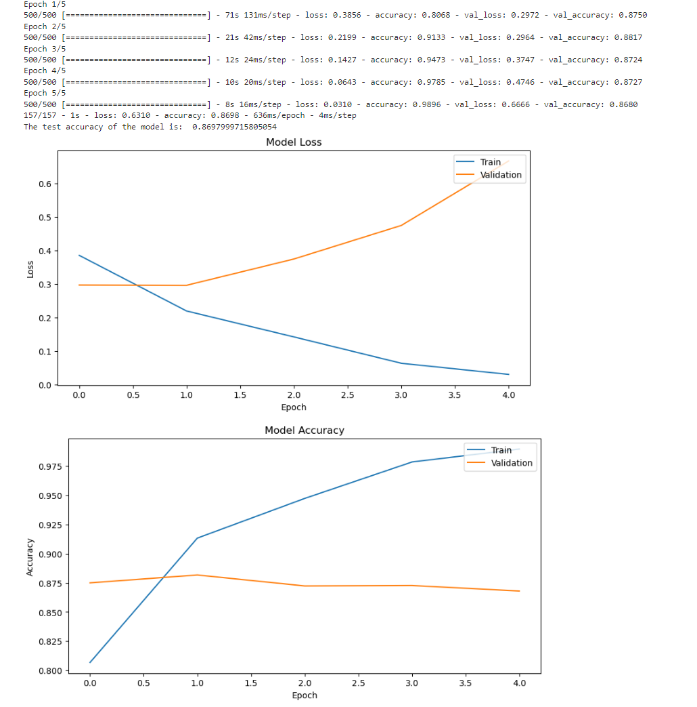
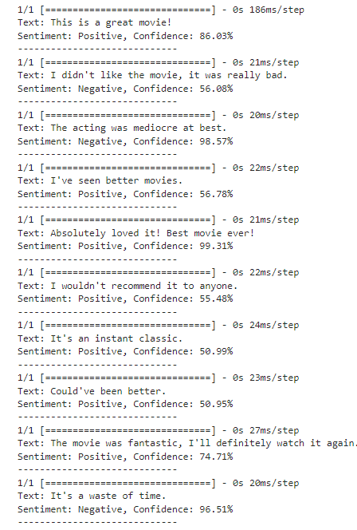

# tp2_deepLearning
Ce projet est un modèle d'analyse de sentiments conçu pour classifier les avis de films IMDB en positifs ou négatifs. Le modèle utilise une combinaison de couches LSTM et Conv1D. Il traite les avis de films bruts en appliquant des techniques de nettoyage et de prétraitement de texte, puis utilise un réseau de neurones pour la classification des sentiments.

## Résultats

Voici les résultats obtenus après l'entraînement du modèle :

